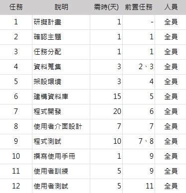
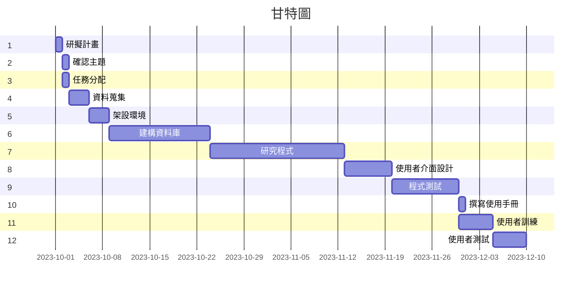
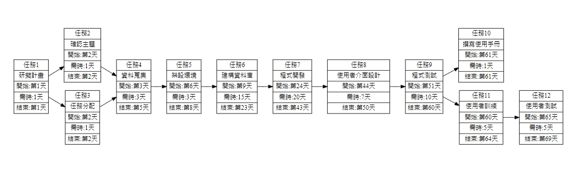

# 分配圖

---

# 甘特圖

```mermaid
gantt
    title 甘特圖

    section 1
    研擬計畫       :a1, 2023-10-01, 1d
    section 2
    確認主題       :a2, after a1, 1d
    section 3
    任務分配      :a3, after a1  , 1d
    section 4
    資料蒐集      :a4, after a3  , 3d
    section 5
    架設環境      :a5, after a4  , 3d
    section 6
    建構資料庫      :a6, after a5, 15d
    section 7
    研究程式      :a7, after a6, 20d
    section 8
    使用者介面設計     :a8, after a7, 7d
    section 9
    程式測試      :a9, after a8, 10d
    section 10
    撰寫使用手冊      :a10, after a9, 1d
    section 11
    使用者訓練      : a11,after a9, 5d
    section 12
    使用者測試      : a12,after a11,5d

```

# PERT

# 關鍵路徑
1 -> 2 -> 3 -> 4 -> 5 -> 9 -> 10 -> 11 -> 12 -> 13 -> 14
