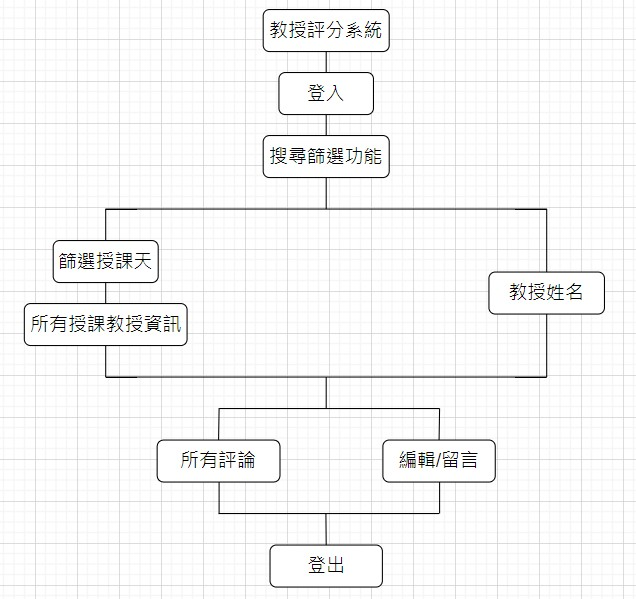

# 功能性需求
```big zone
1. 登入：
2. 教授搜尋功能：
3. 教授討論版：
4. 有留言編輯功能：
5. 可查詢一天中有上課的導師：
3. 登出：
```

# 非功能性需求
```big zone
1. 
2. 
```

# 功能分解圖


# 使用案例圖


# 使用案例說明

# Figma動態模擬畫面
https://www.figma.com/file/7tQOhNwKdpoUnOn2sSzlsB/%E7%B3%BB%E7%B5%B1%E5%88%86%E6%9E%90%E8%88%87%E8%A8%AD%E8%A8%88?type=design&mode=design&t=4tRVWGRl6EX7VubS-0
