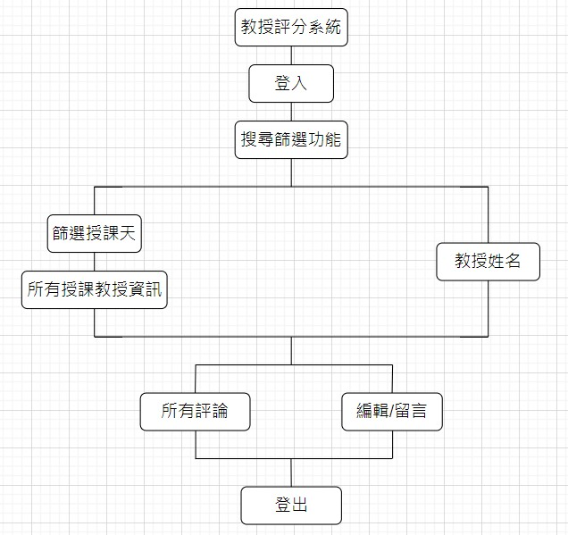
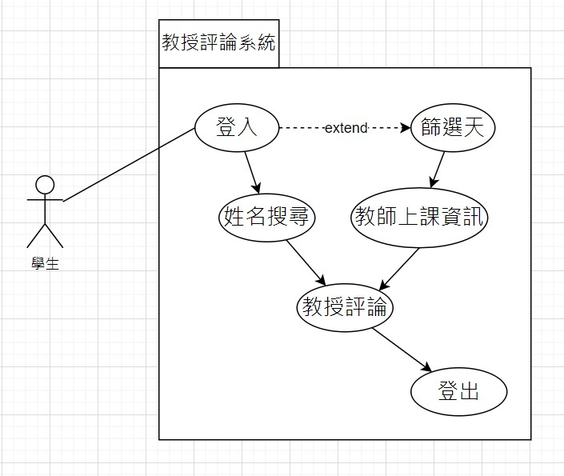

# 功能性需求
```big zone
1. 登入：登入學校帳號密碼。
2. 教授搜尋功能：以教授的名字搜尋討論版。
3. 教授討論版：可在下面看到教授的規範評論。
4. 有留言編輯功能：可以發表對老師的看法。
5. 可查詢一天中有上課的導師：若不知道老師姓名，可另外透過星期幾來篩選上課的老師有哪些。
6. 登出：登出系統。
```

# 非功能性需求
```big zone
1. 
2. 
```

# 功能分解圖


# 需求分析的文字描述
```big zone
1. 首先必須要先登入系統
2. 進入之後選擇自己要用的搜尋方式
3. 若選擇搜尋教授姓名，打上姓名後按下確定就會到該就瘦的評論版
4. 如果不知道教師姓名，則可選擇搜尋星期幾上課，就會跳出當天有上課得所有老師，再去選擇自己想看的評論版
5. 在評論版中，還可以留言與編輯自己先前的留言
6. 系統使用完畢，登出系統。
```


# 使用案例圖


# 使用案例說明

# Figma動態模擬畫面
https://www.figma.com/file/7tQOhNwKdpoUnOn2sSzlsB/%E7%B3%BB%E7%B5%B1%E5%88%86%E6%9E%90%E8%88%87%E8%A8%AD%E8%A8%88?type=design&mode=design&t=4tRVWGRl6EX7VubS-0
